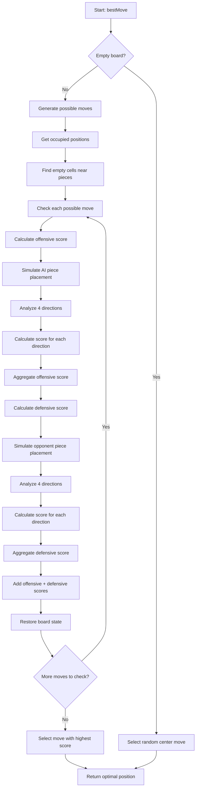
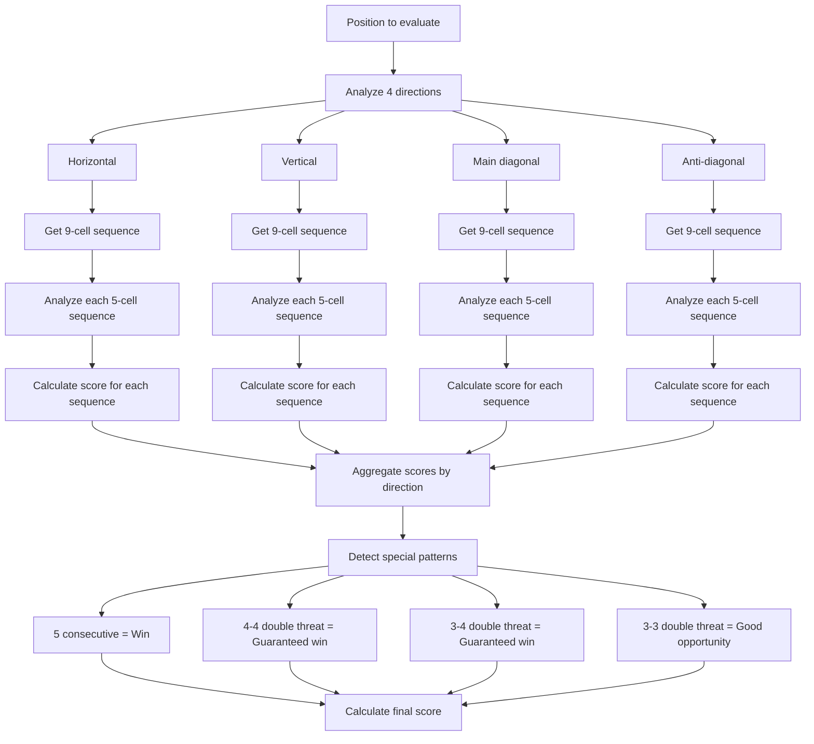
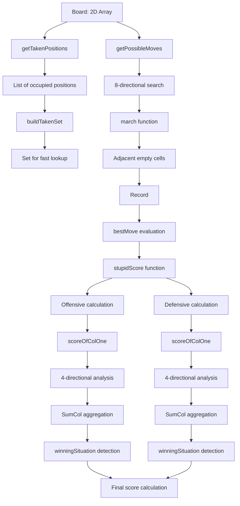

# AI Service - Caro Game Artificial Intelligence

## Overview

AiService provides artificial intelligence for the Caro game (Gomoku), using board evaluation algorithms to find optimal moves. This service handles all AI logic from board analysis to selecting the best move.

## Logic Flow Diagram



## Main Logic Flow

### 1. Optimal Move Finding Algorithm

#### Step 1: Check Board State
```typescript
if (this.isEmpty(board)) {
    return this.getRandomCenterMove(board);
}
```
- If board is empty, select a random move in the center area
- Optimized for the first move

#### Step 2: Generate Possible Moves
```typescript
const moves = this.getPossibleMoves(board);
```
- Only consider empty cells near already placed pieces
- Reduces search space from O(n²) to O(k) where k << n²
- Uses "march" algorithm to find adjacent positions

#### Step 3: Evaluate Each Move
```typescript
const scorePlayer = this.stupidScore(board, player, antiPlayer, row, col);
```
- Calculate score for each possible move
- Combines offensive and defensive scores

### 2. Board Evaluation System

#### Board Evaluation Flow Diagram



#### Score Structure
- **Offensive Score (Advantage)**: Benefits when AI makes this move
- **Defensive Score (Defense)**: Benefits when blocking opponent

#### Priority Levels
1. **Level 5**: Immediate win (5 consecutive pieces)
2. **Level 4**: Double threat 4-4 or 4-3 (guaranteed win)
3. **Level 3**: Double threat 3-3 (two sequences of 3 pieces)
4. **Level 0**: Normal board position

#### Weight Coefficients
```typescript
adv += (finalScoresAttack[-1] || 0) +
       (finalScoresAttack[1] || 0) +
       4 * (finalScoresAttack[2] || 0) +
       8 * (finalScoresAttack[3] || 0) +
       16 * (finalScoresAttack[4] || 0);
```

### 3. Board Analysis Algorithm

#### Directional Analysis
- **4 main directions**: horizontal, vertical, main diagonal, anti-diagonal
- Each direction is analyzed independently
- Results are aggregated from all directions

#### Special Position Detection
- **3-4 Double Threat**: One sequence of 4 and one sequence of 3 in different directions
- **3-3 Double Threat**: Two sequences of 3 pieces in different directions
- **4-4 Double Threat**: Two sequences of 4 pieces (guaranteed win)

### 4. Performance Optimization

#### Data Structure Flow Diagram



#### Search Space Reduction
- Only consider empty cells near already placed pieces
- Use Set for fast occupied position checking
- Limit search distance (1-4 cells)

#### Efficient Data Structures
- Use Record<string, boolean> for move list
- Convert positions to strings for fast comparison
- Cache computation results when possible

## API Interface

### AiService.bestMove(board: Board, player: PlayerEnum): IPosition

**Parameters:**
- `board`: Current board state (2D matrix)
- `player`: Current player (X or O)

**Returns:**
- `IPosition`: Optimal position for the next move

**Usage Example:**
```typescript
const aiService = new AiService();
const bestMove = aiService.bestMove(board, PlayerEnum.X);
console.log(`Best move: (${bestMove.row}, ${bestMove.col})`);
```

## Technical Features

### Complexity
- **Time**: O(k × m) where k is number of possible moves, m is number of analysis directions
- **Space**: O(n²) for board storage

### Accuracy
- Accurately detects win/lose positions
- Prioritizes defense when necessary
- Balances offense and defense

### Extensibility
- Easy to adjust weight coefficients
- Can add new special positions
- Supports different board sizes

## Configuration and Customization

### Difficulty Adjustment
- Modify weight coefficients in `stupidScore()`
- Adjust position detection thresholds in `winningSituation()`
- Add more complex evaluation logic


## Algorithm Details

### Move Generation
The AI uses a smart move generation strategy:
1. **Adjacent Search**: Only considers positions within 1-4 cells of existing pieces
2. **Directional March**: Uses 8-directional search (horizontal, vertical, diagonal)
3. **Boundary Handling**: Automatically adjusts for board boundaries

### Position Evaluation
Each position is evaluated using a two-phase approach:
1. **Offensive Phase**: Simulate placing AI's piece and calculate benefits
2. **Defensive Phase**: Simulate opponent's move and calculate blocking benefits

### Score Calculation
The scoring system uses weighted coefficients:
- **Level 1**: Basic piece placement (weight: 1)
- **Level 2**: Two in a row (weight: 4)
- **Level 3**: Three in a row (weight: 8)
- **Level 4**: Four in a row (weight: 16)
- **Level 5**: Five in a row (weight: 1000)

### Special Patterns
The AI recognizes several winning patterns:
- **Immediate Win**: 5 consecutive pieces
- **Double Threat**: Multiple winning threats in different directions
- **Forced Win**: Positions that guarantee victory regardless of opponent response
