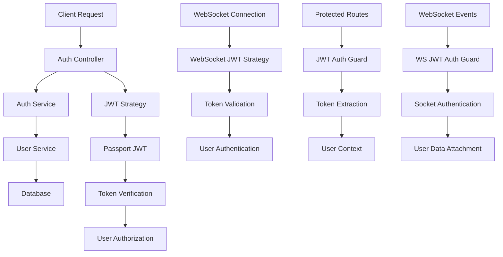
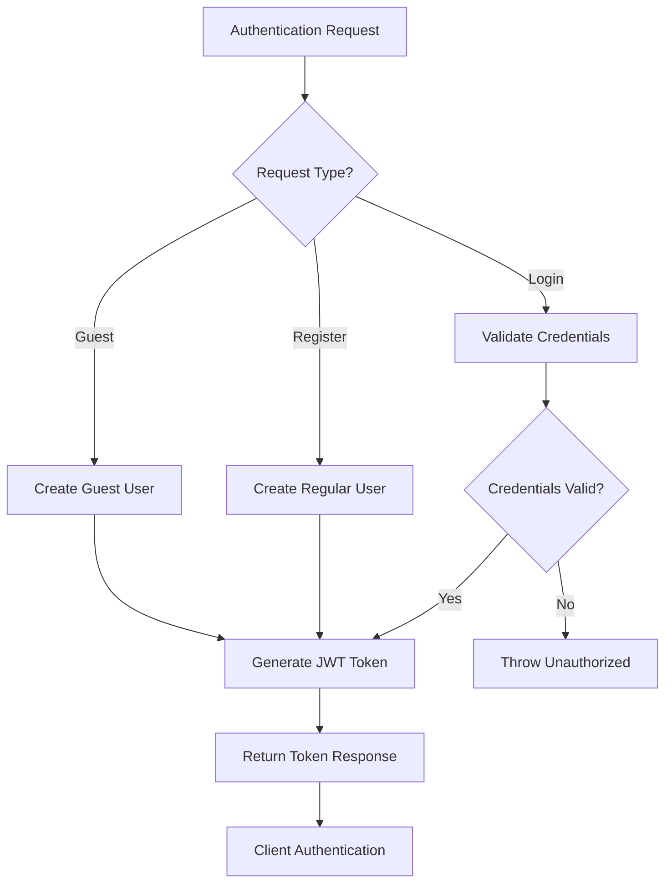
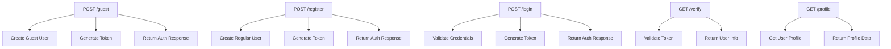
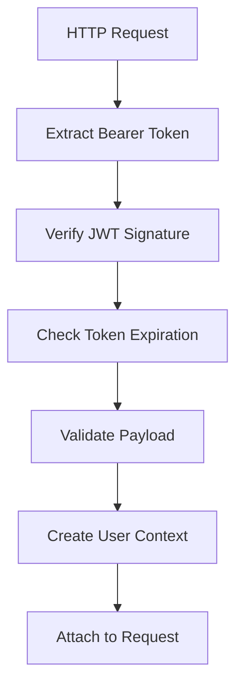
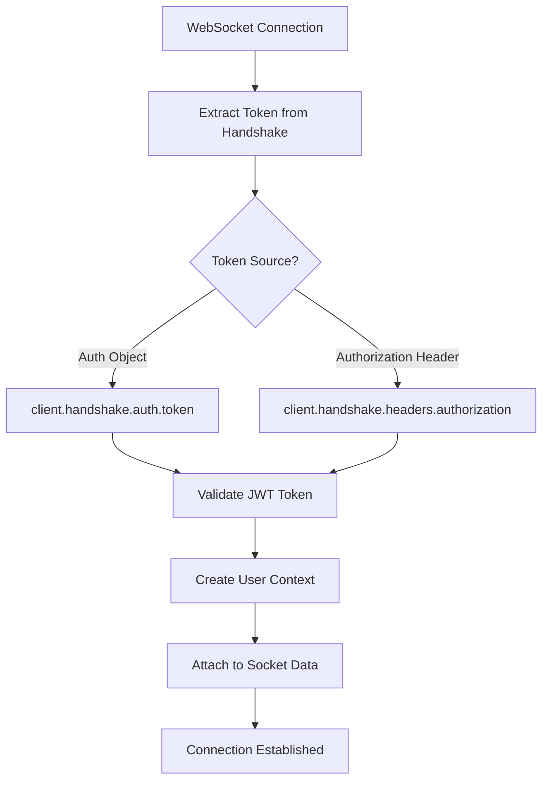

# Auth Module - Authentication and Authorization System

## Overview

The Auth Module provides comprehensive authentication and authorization for the Caro game application, supporting both HTTP REST API and WebSocket connections. This module handles user registration, login, guest user creation, JWT token management, and secure access control across all application endpoints.

## Architecture Diagram



## Main Components

### 1. AuthService

#### Authentication Flow



#### Token Generation Process
1. **User Creation/Validation**: Create new user or validate existing credentials
2. **JWT Payload Creation**: Extract user information for token payload
3. **Token Signing**: Sign JWT with secret key and expiration
4. **Response Formation**: Return user data and access token

### 2. AuthController

#### REST API Endpoints



#### API Endpoint Details

**POST /guest** - Guest User Creation
- Creates temporary guest user account
- No email/password required
- Immediate authentication
- Perfect for quick game access

**POST /register** - User Registration
- Creates permanent user account
- Requires email and password
- Email uniqueness validation
- Full user profile creation

**POST /login** - User Authentication
- Validates email and password
- Returns JWT token for authenticated user
- Supports both guest and regular users
- Secure credential validation

**GET /verify** - Token Verification
- Validates current JWT token
- Returns user information
- Protected endpoint requiring authentication
- Token refresh capability

**GET /profile** - User Profile
- Retrieves complete user profile
- Protected endpoint
- Returns user statistics and preferences
- Supports both guest and regular users

### 3. JWT Strategy

#### HTTP Authentication Strategy



#### Token Extraction Process
1. **Authorization Header**: Extracts token from `Authorization: Bearer <token>`
2. **JWT Verification**: Validates signature and expiration
3. **Payload Validation**: Ensures required fields are present
4. **User Context**: Creates authenticated user object
5. **Request Attachment**: Attaches user to request object

### 4. WebSocket JWT Strategy

#### WebSocket Authentication Flow



#### WebSocket Token Sources
- **Auth Object**: `client.handshake.auth.token`
- **Authorization Header**: `client.handshake.headers.authorization`
- **Bearer Token**: Extracts from `Bearer <token>` format

### 5. Guards and Decorators

#### Authentication Guards

**JwtAuthGuard** - HTTP Route Protection
- Extends Passport JWT strategy
- Protects REST API endpoints
- Automatic token validation
- User context injection

**WsJwtAuthGuard** - WebSocket Protection
- Custom WebSocket authentication
- Socket-specific token validation
- User data attachment to socket
- Connection-level security

#### Parameter Decorators

**@CurrentUser()** - HTTP User Context
- Extracts authenticated user from request
- Type-safe user object access
- Automatic user information injection

**@AccessToken()** - Token Access
- Extracts JWT token from request headers
- Direct token access for verification
- Bearer token parsing

**@WsCurrentUser()** - WebSocket User Context
- Extracts user from socket data
- WebSocket-specific user access
- Real-time user context

## Key Features

### 1. Dual Authentication Support

#### Guest User System
```typescript
// Guest user creation
const guestUser = await authService.createGuestUserWithToken({
    name: "Guest Player"
})

// No email/password required
// Immediate game access
// Temporary account
```

#### Regular User System
```typescript
// User registration
const user = await authService.createUserWithToken({
    name: "John Doe",
    email: "john@example.com",
    password: "securePassword"
})

// Persistent account
// Email/password authentication
// Full user profile
```

### 2. JWT Token Management

#### Token Structure
```typescript
interface IJwtPayload {
    sub: string;        // User ID
    name: string;       // User name
    isGuest: number;     // Guest status (0/1)
    iat?: number;       // Issued at
    exp?: number;        // Expiration
}
```

#### Token Configuration
- **Secret Key**: Configurable JWT secret
- **Expiration**: Configurable token lifetime
- **Algorithm**: HS256 signing algorithm
- **Claims**: Standard JWT claims with custom fields

### 3. Multi-Protocol Support

#### HTTP Authentication
- Bearer token in Authorization header
- Passport JWT strategy integration
- Automatic token validation
- Request-scoped user context

#### WebSocket Authentication
- Token in handshake auth object
- Custom WebSocket JWT strategy
- Socket-level user attachment
- Real-time authentication

### 4. Security Features

#### Input Validation
- DTO-based request validation
- Email format validation
- Password strength requirements
- Input sanitization

#### Token Security
- JWT signature verification
- Token expiration checking
- Secure secret key management
- Token refresh capability

#### Authorization
- Route-level protection
- User context injection
- Guest vs regular user handling
- Permission-based access control

## API Interface

### REST Endpoints

#### POST /guest
**Request Body:**
```typescript
{
    name: string    // Guest user name
}
```

**Response:**
```typescript
{
    user: {
        id: string,
        name: string,
        isGuest: 1
    },
    token: string
}
```

#### POST /register
**Request Body:**
```typescript
{
    name: string,        // User name
    email: string,       // User email
    password: string     // User password
}
```

**Response:**
```typescript
{
    user: {
        id: string,
        name: string,
        isGuest: 0
    },
    token: string
}
```

#### POST /login
**Request Body:**
```typescript
{
    email: string,       // User email
    password: string     // User password
}
```

**Response:**
```typescript
{
    user: {
        id: string,
        name: string,
        isGuest: 0
    },
    token: string
}
```

#### GET /verify
**Headers:**
```
Authorization: Bearer <token>
```

**Response:**
```typescript
{
    user: {
        id: string,
        name: string,
        isGuest: number
    },
    token: string
}
```

#### GET /profile
**Headers:**
```
Authorization: Bearer <token>
```

**Response:**
```typescript
{
    id: string,
    name: string,
    email: string,
    isGuest: number,
    elo: number,
    // ... other user fields
}
```

### WebSocket Authentication

#### Connection Handshake
```typescript
// Option 1: Auth object
const socket = io('ws://localhost', {
    auth: {
        token: 'jwt_token_here'
    }
})

// Option 2: Authorization header
const socket = io('ws://localhost', {
    extraHeaders: {
        'Authorization': 'Bearer jwt_token_here'
    }
})
```

#### Authenticated Socket Data
```typescript
interface AuthenticatedSocket {
    data: {
        user: {
            userId: string,
            name: string,
            isGuest: number
        }
    }
}
```

## Error Handling

### Authentication Errors
- **Invalid Credentials**: Wrong email/password combination
- **Token Expired**: JWT token has expired
- **Invalid Token**: Malformed or invalid JWT
- **Unauthorized Access**: Missing or invalid authentication

### Validation Errors
- **Email Already Exists**: Duplicate email during registration
- **Invalid Email Format**: Malformed email address
- **Weak Password**: Password doesn't meet requirements
- **Missing Required Fields**: Required fields not provided

### WebSocket Errors
- **Connection Failed**: WebSocket authentication failure
- **Token Missing**: No token provided in handshake
- **Invalid Socket Token**: WebSocket token validation failed
- **User Not Found**: Authenticated user doesn't exist

## Integration Points

### Dependencies
- **UserModule**: User management and database operations
- **JwtModule**: JWT token generation and verification
- **PassportModule**: Authentication strategy framework
- **AppConfigModule**: Configuration management

### Exports
- **AuthService**: Core authentication logic
- **JwtAuthGuard**: HTTP route protection
- **WsJwtAuthGuard**: WebSocket protection
- **JwtStrategy**: HTTP JWT authentication
- **WebSocketJwtStrategy**: WebSocket JWT authentication

### Event Flow
1. **Authentication Request** → Service Processing
2. **User Creation/Validation** → Database Operations
3. **Token Generation** → JWT Signing
4. **Response Formation** → Client Authentication
5. **Protected Access** → Guard Validation

## Security Considerations

### Token Security
- **Secret Key Management**: Secure JWT secret storage
- **Token Expiration**: Configurable token lifetime
- **Signature Verification**: JWT signature validation
- **Token Refresh**: Secure token renewal process

### Input Validation
- **Email Validation**: Proper email format checking
- **Password Security**: Password strength requirements
- **Input Sanitization**: XSS and injection prevention
- **Data Validation**: DTO-based request validation

### Access Control
- **Route Protection**: Guard-based endpoint security
- **User Context**: Secure user information injection
- **Permission Levels**: Guest vs regular user handling
- **Session Management**: Secure session handling

## Performance Characteristics

### Authentication Speed
- **JWT Verification**: O(1) token validation
- **User Lookup**: O(1) database queries with proper indexing
- **Token Generation**: O(1) JWT signing
- **Guard Processing**: Minimal overhead for route protection

### Scalability Features
- **Stateless Authentication**: JWT-based stateless design
- **Horizontal Scaling**: No server-side session storage
- **Load Balancing**: Token-based authentication across instances
- **Caching**: User data caching for improved performance
