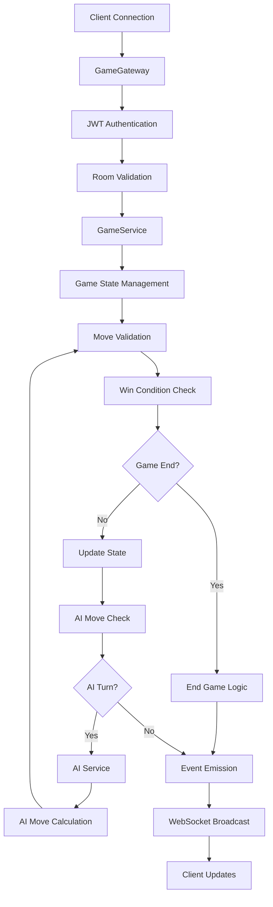
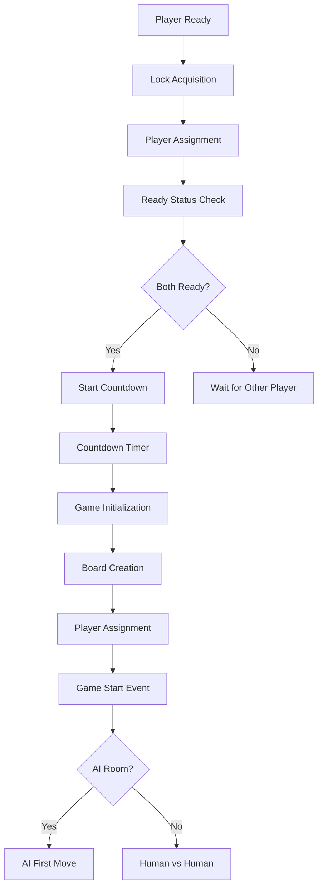
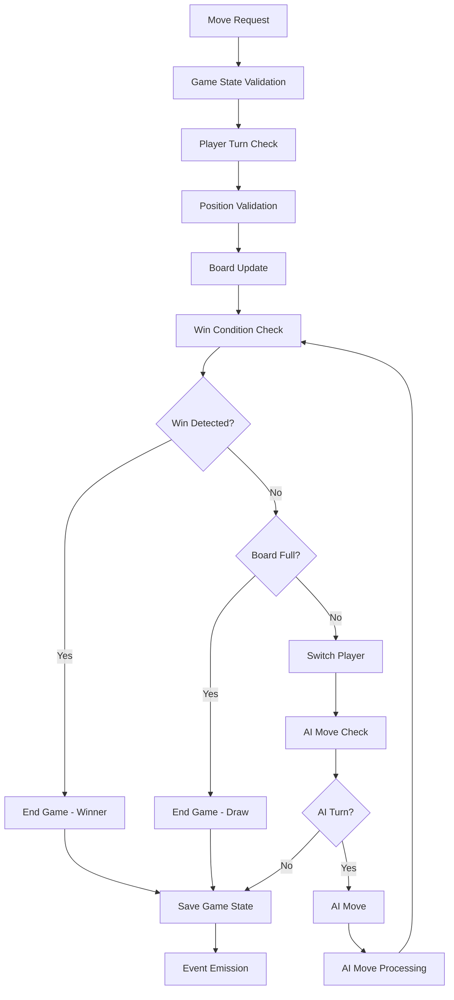
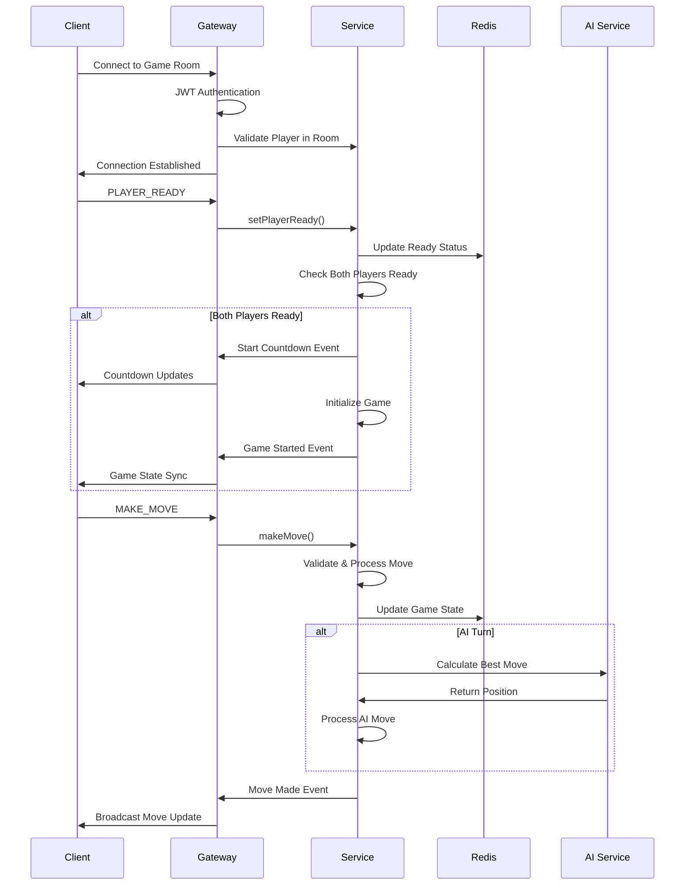
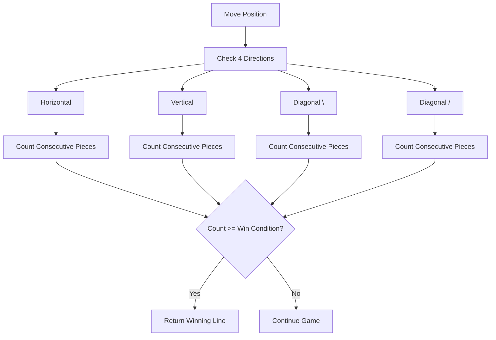
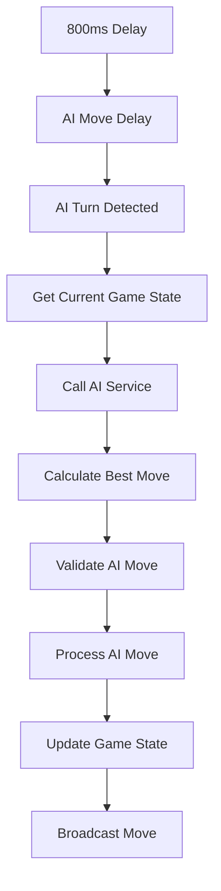
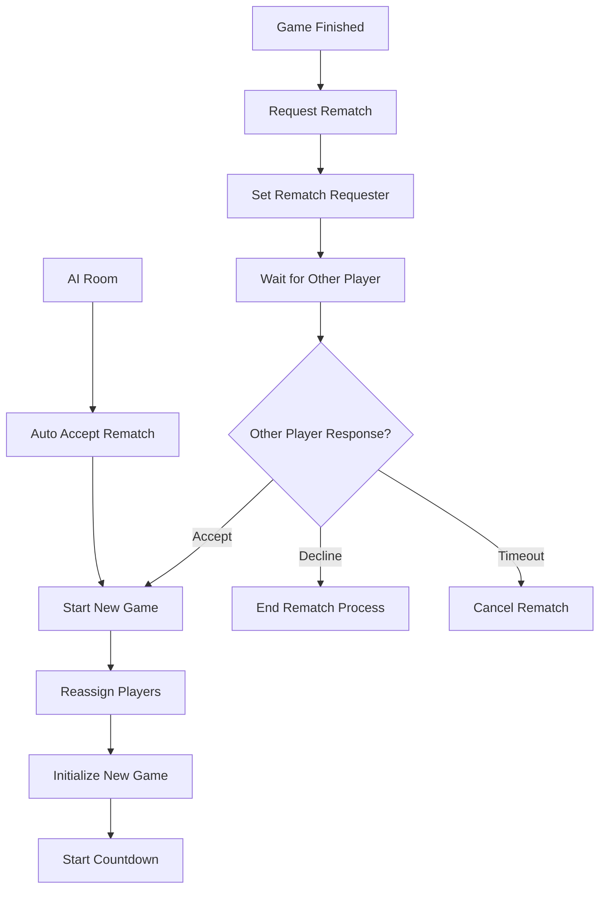

# Game Service - Caro Game Core Logic System

## Overview

The Game Service provides the core game logic for the Caro (Gomoku) game, handling game state management, move validation, win condition checking, AI integration, and real-time multiplayer functionality. This service manages both human vs human and human vs AI game modes with comprehensive WebSocket communication.

## Architecture Diagram



## Main Components

### 1. GameService

#### Game State Management Flow



#### Move Processing Algorithm



### 2. GameGateway

#### WebSocket Event Flow



## Key Features

### 1. Game State Management

#### State Structure
```typescript
interface IGameState {
    id: string                    // Unique game ID
    roomType: RoomTypeEnum        // AI or HUMAN
    board: (PlayerEnum | null)[][] // Game board matrix
    currentPlayer: PlayerEnum     // X or O
    isGameActive: boolean         // Game status
    moveCount: number            // Total moves made
    winCondition: number         // Required consecutive pieces
    playerXId: string            // Player X user ID
    playerOId: string            // Player O user ID
    lastMoveTime?: string        // Last move timestamp
    lastMovePosition?: IPosition // Last move coordinates
    startTime: string            // Game start time
    finishedAt?: string          // Game end time
}
```

#### State Persistence
- **Redis Storage**: Game state stored in Redis for fast access
- **Atomic Updates**: All state changes are atomic operations
- **Real-time Sync**: State changes immediately broadcast to clients

### 2. Win Condition Detection

#### Multi-Directional Analysis


#### Win Detection Algorithm
- **Directional Search**: Checks horizontal, vertical, and both diagonal directions
- **Bidirectional Counting**: Counts pieces in both positive and negative directions
- **Winning Line Tracking**: Records exact positions of winning sequence
- **Configurable Win Condition**: Supports different win conditions (3, 4, 5, etc.)

### 3. AI Integration

#### AI Move Processing


#### AI Features
- **Smart Move Calculation**: Uses advanced board evaluation algorithms
- **Realistic Timing**: 800ms delay to simulate human thinking time
- **Seamless Integration**: AI moves processed through same validation pipeline
- **Random Assignment**: AI can be either X or O player

### 4. Player Management

#### Player Assignment Strategy
```typescript
// Random assignment for both AI and human rooms
const randomIndex = Math.floor(Math.random() * 2)
const playerXId = randomIndex === 0 ? player1 : player2
const playerOId = randomIndex === 0 ? player2 : player1
```

#### Ready Status Management
- **Lock-based Synchronization**: Prevents race conditions during ready status updates
- **Atomic Operations**: Ready status changes are atomic
- **Automatic Game Start**: Game starts when both players are ready

### 5. Rematch System

#### Rematch Flow


## API Interface

### WebSocket Events

#### Client → Server

**PLAYER_READY**
```typescript
// No payload required
// Sets current player as ready
```

**MAKE_MOVE**
```typescript
{
    row: number,    // Row position (0-based)
    col: number     // Column position (0-based)
}
```

**GET_GAME_STATE**
```typescript
// No payload required
// Returns current game state
```

**REQUEST_REMATCH**
```typescript
// No payload required
// Requests a rematch after game ends
```

**ACCEPT_REMATCH**
```typescript
// No payload required
// Accepts a rematch request
```

**DECLINE_REMATCH**
```typescript
// No payload required
// Declines a rematch request
```

#### Server → Client

**GAME_START_COUNTDOWN**
```typescript
{
    countdown: number,           // Countdown value (3, 2, 1, 0)
    message: string              // Countdown message
}
```

**GAME_STARTED**
```typescript
{
    gameState: IGameState,       // Complete game state
    players: IPlayerAssignment,  // Player assignments
    message: string              // Start message
}
```

**GAME_MOVE_MADE**
```typescript
{
    move: IGameMove,             // Move details
    gameState: IGameState,       // Updated game state
    nextPlayer: PlayerEnum       // Next player to move
}
```

**GAME_FINISHED**
```typescript
{
    winner: PlayerWinnerEnum,    // Winner (X, O, DRAW)
    winningLine?: IPosition[],   // Winning line positions
    gameState: IGameState        // Final game state
}
```

**REQUEST_REMATCH**
```typescript
{
    userId: string,              // Player requesting rematch
    name: string                 // Player name
}
```

### Service Methods

#### GameService.setPlayerReady()
**Parameters:**
- `roomId`: Room identifier
- `userId`: User identifier

**Process:**
1. Acquires distributed lock to prevent race conditions
2. Validates room status and player assignment
3. Updates player ready status
4. Triggers game start if both players ready

#### GameService.makeMove()
**Parameters:**
- `userId`: User making the move
- `roomId`: Room identifier
- `makeMoveDto`: Move coordinates

**Process:**
1. Validates game state and player turn
2. Validates move position and availability
3. Updates game state with move
4. Checks win conditions
5. Handles AI move if applicable
6. Emits move events

#### GameService.getGameStateForPlayer()
**Parameters:**
- `roomId`: Room identifier

**Returns:**
- Complete game state with player assignments and game result

## Game Rules and Logic

### 1. Board Configuration
- **Dynamic Board Size**: Configurable board dimensions (e.g., 15x15)
- **Flexible Win Condition**: Configurable consecutive pieces required (e.g., 5)
- **Empty Board Initialization**: All positions start as null

### 2. Move Validation
- **Turn-based Play**: Players alternate moves (X goes first)
- **Position Validation**: Moves must be within board boundaries
- **Occupancy Check**: Cannot place piece on occupied position
- **Game Status Check**: Only valid moves during active games

### 3. Win Detection
- **Consecutive Pieces**: Counts consecutive pieces in all directions
- **Winning Line**: Tracks exact positions of winning sequence
- **Draw Detection**: Game ends in draw when board is full
- **Immediate Detection**: Win detected immediately after move

### 4. Game Lifecycle
1. **Room Creation**: Game room created with players
2. **Player Ready**: Both players must be ready
3. **Countdown**: 3-second countdown before game starts
4. **Game Play**: Alternating moves until win or draw
5. **Game End**: Winner determined or draw declared
6. **Rematch**: Optional rematch system

## Performance Characteristics

### Time Complexity
- **Move Validation**: O(1) for position and turn checks
- **Win Detection**: O(k) where k is win condition (typically 5)
- **State Updates**: O(1) for Redis operations
- **AI Integration**: O(n²) for board evaluation

### Space Complexity
- **Game State**: O(n²) for board storage
- **Move History**: O(m) where m is total moves
- **Redis Storage**: O(1) per game room

### Scalability Features
- **Distributed Locks**: Prevents race conditions in multi-instance deployments
- **Redis-based State**: Fast state access and updates
- **Event-driven Architecture**: Efficient real-time communication
- **AI Optimization**: Cached AI calculations for better performance

## Error Handling

### Validation Errors
- **Invalid Move**: Position out of bounds or occupied
- **Wrong Turn**: Player attempting to move out of turn
- **Game Not Active**: Move attempted on finished game
- **Player Not in Game**: Unauthorized access to game room

### System Errors
- **Lock Timeout**: Distributed lock acquisition timeout
- **Redis Connection**: Database connection issues
- **AI Service**: AI calculation failures
- **Event Emission**: Event system failures

### Graceful Degradation
- **Connection Loss**: Automatic cleanup on disconnect
- **Service Unavailable**: Proper error propagation
- **Lock Contention**: Retry mechanisms for lock acquisition

## Integration Points

### Dependencies
- **RoomService**: Room management and player validation
- **AiService**: AI move calculation
- **LockService**: Distributed locking for concurrency control
- **EventEmitter**: Inter-service communication
- **Redis**: State persistence and caching

### Event Flow
1. **Game Events** → Service Processing
2. **State Changes** → Redis Persistence
3. **Event Emission** → Gateway Broadcasting
4. **Client Updates** → Real-time WebSocket communication

## Security Considerations

### Authentication
- JWT token validation for all WebSocket connections
- Player authorization for game room access
- User identity verification for move validation

### Concurrency Control
- Distributed locks prevent race conditions
- Atomic operations ensure data consistency
- Proper error handling for lock timeouts

