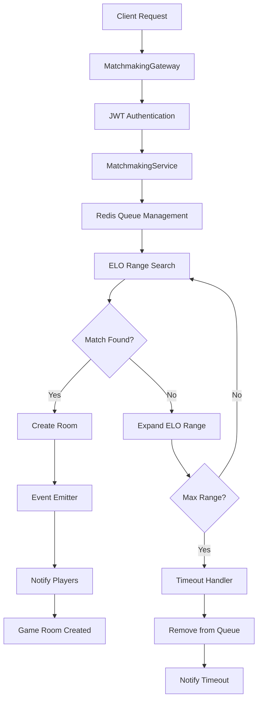
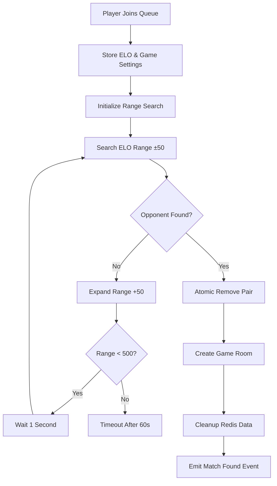
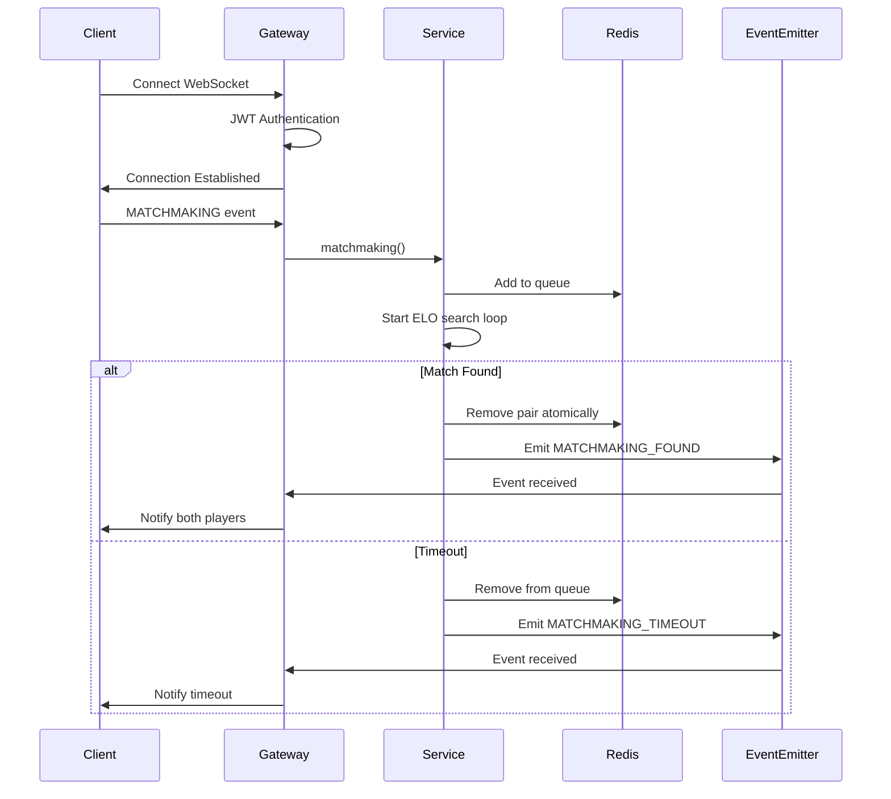

# Matchmaking Service - Caro Game Player Matching System

## Overview

The Matchmaking Service provides intelligent player matching for the Caro game using ELO-based skill rating and WebSocket real-time communication. This service handles player queue management, skill-based matching, timeout handling, and room creation for matched players.

## Architecture Diagram



## Main Components

### 1. MatchmakingService

#### Core Matching Algorithm



#### ELO-Based Matching Strategy

The service uses a progressive ELO range expansion algorithm:

1. **Initial Range**: ±50 ELO points
2. **Range Step**: +50 ELO points per iteration
3. **Maximum Range**: ±500 ELO points
4. **Search Delay**: 1 second between iterations
5. **Timeout**: 60 seconds maximum wait time

#### Redis Data Structure

```typescript
// Queue Storage (Sorted Set)
matchmaking:queue:{boardSize}:{winCondition} -> ZADD(elo, userId)

// User Session Data (Hash)
matchmaking:user:{userId} -> HSET(boardSize, winCondition)

// Timeout Tracking (String)
matchmaking:timeout:{userId} -> sessionId
```

### 2. MatchmakingGateway

#### WebSocket Event Flow



#### Authentication Middleware

The gateway implements JWT-based authentication for WebSocket connections:

1. **Token Validation**: Verifies JWT token from client
2. **User Verification**: Confirms user exists in database
3. **Connection Authorization**: Attaches user data to socket

## Key Features

### 1. Atomic Operations

#### Pair Removal with Lua Script
```lua
local exists1 = redis.call("ZSCORE", KEYS[1], ARGV[1])
local exists2 = redis.call("ZSCORE", KEYS[1], ARGV[2])

if (exists1 and exists2) then
    redis.call("ZREM", KEYS[1], ARGV[1], ARGV[2])
    return 1
else
    return 0
end
```

This ensures thread-safe removal of matched players from the queue.

### 2. Timeout Management

#### Session-Based Timeout
- Each matchmaking session has a unique session ID
- Timeout handler checks session validity before cleanup
- Prevents race conditions with concurrent operations

### 3. Event-Driven Architecture

#### Event Types
- `MATCHMAKING_FOUND`: Successful match created
- `MATCHMAKING_TIMEOUT`: No opponent found within time limit

#### Event Payloads
```typescript
// Match Found
{
    playerA: string,
    playerB: string,
    roomId: string
}

// Timeout
{
    userId: string
}
```

## API Interface

### WebSocket Events

#### Client → Server

**MATCHMAKING**
```typescript
{
    boardSize: number,    // Game board size (e.g., 15)
    winCondition: number  // Win condition (e.g., 5)
}
```

**MATCHMAKING_CANCEL**
```typescript
// No payload required
```

#### Server → Client

**MATCHMAKING_FOUND**
```typescript
{
    playerA: string,      // First player ID
    playerB: string,      // Second player ID
    roomId: string        // Created room ID
}
```

**MATCHMAKING_TIMEOUT**
```typescript
{
    message: string       // Timeout message
}
```

### Service Methods

#### MatchmakingService.matchmaking()
**Parameters:**
- `client`: WebSocket client with authenticated user data
- `payload`: MatchmakingDto containing game settings

**Process:**
1. Validates user and retrieves ELO rating
2. Adds user to appropriate queue based on game settings
3. Initiates progressive ELO range search
4. Handles match creation or timeout

#### MatchmakingService.matchmakingCancel()
**Parameters:**
- `client`: WebSocket client with authenticated user data

**Process:**
1. Removes user from all matchmaking queues
2. Cleans up Redis session data
3. Cancels timeout handlers

## Configuration

### Matching Parameters
```typescript
const rangeStep = 50        // ELO range increment
const maxRange = 500        // Maximum ELO range
const delay = 1000          // Search delay (ms)
const timeout = 60000       // Matchmaking timeout (ms)
```

### Redis Keys
```typescript
// Queue keys
`matchmaking:queue:${boardSize}:${winCondition}`

// User session keys
`matchmaking:user:${userId}`
`matchmaking:timeout:${userId}`
```

## Performance Characteristics

### Time Complexity
- **Queue Operations**: O(log N) for sorted set operations
- **Range Search**: O(log N + M) where M is result count
- **Overall Matching**: O(R × log N) where R is range iterations

### Space Complexity
- **Per User**: O(1) for session data
- **Queue Storage**: O(N) where N is active users
- **Memory Usage**: Minimal with Redis optimization

### Scalability Features
- **Horizontal Scaling**: Redis-based distributed queues
- **Concurrent Matching**: Atomic operations prevent race conditions
- **Resource Cleanup**: Automatic timeout and disconnect handling

## Error Handling

### WebSocket Exceptions
- **Authentication Errors**: Invalid or expired JWT tokens
- **Validation Errors**: Invalid game parameters
- **Service Errors**: Database or Redis connection issues

### Graceful Degradation
- **Connection Loss**: Automatic cleanup on disconnect
- **Service Unavailable**: Proper error propagation to clients
- **Timeout Handling**: Clean removal from queues

## Integration Points

### Dependencies
- **UserService**: User validation and ELO retrieval
- **RoomService**: Game room creation
- **EventEmitter**: Inter-service communication
- **Redis**: Queue and session management

### Event Flow
1. **Matchmaking Request** → Service Processing
2. **Match Found** → Room Creation → Event Emission
3. **Event Reception** → Client Notification
4. **Game Start** → Room Service Handoff

## Security Considerations

### Authentication
- JWT token validation on every WebSocket connection
- User existence verification before queue operations
- Session-based timeout management

### Data Protection
- No sensitive data in Redis queues
- Atomic operations prevent data corruption
- Automatic cleanup on disconnect/timeout

