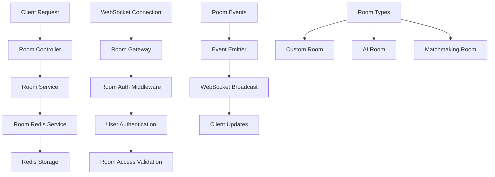
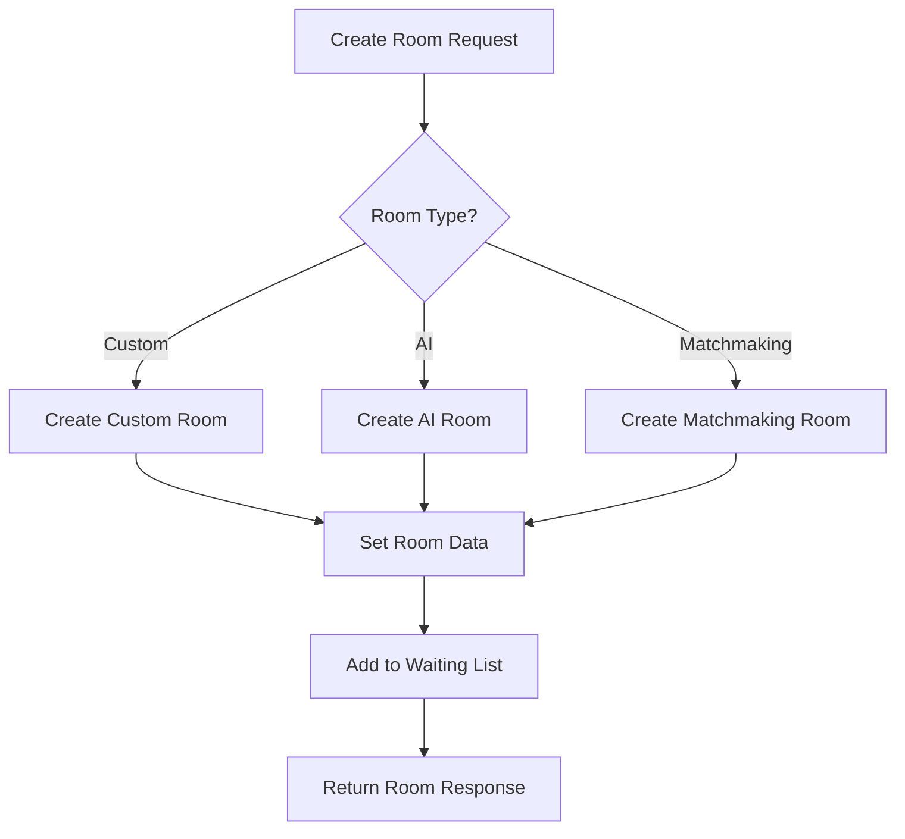
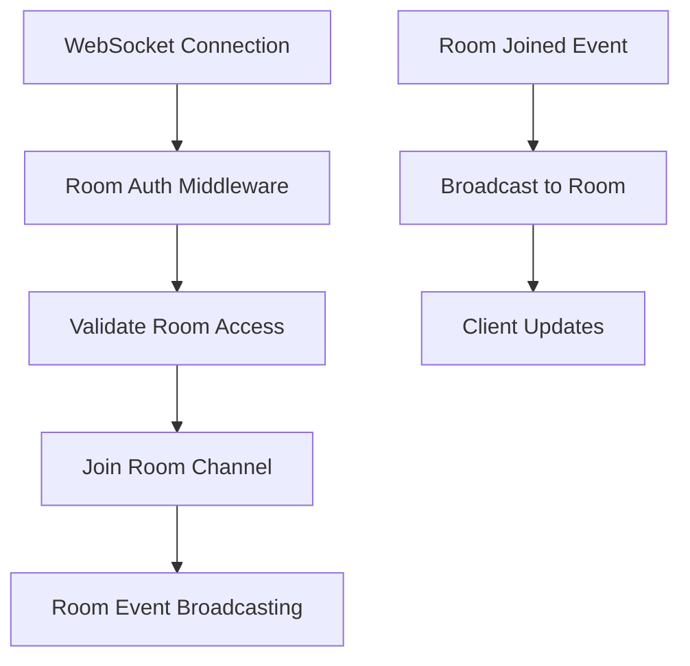
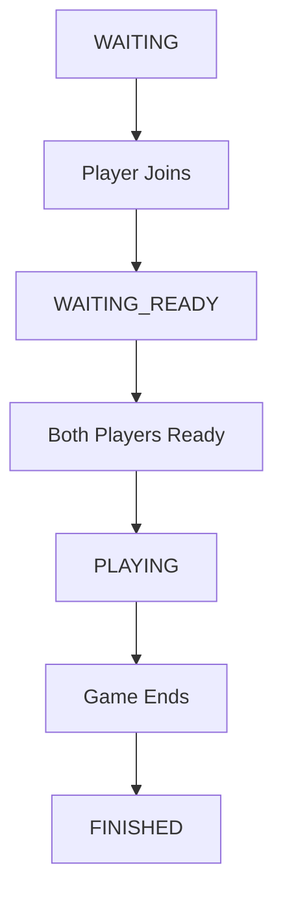

# Room Module - Game Room Management System

## Overview

The Room Module provides comprehensive room management for the Caro game, handling room creation, joining, player management, and real-time room updates. This module supports custom rooms, AI rooms, and matchmaking rooms with Redis-based state management and WebSocket communication.

## Architecture Diagram



## Main Components

### 1. RoomService

#### Room Creation Flow



#### Room Management Features
- **Custom Rooms**: User-created rooms with password protection
- **AI Rooms**: Single-player rooms against AI opponent
- **Matchmaking Rooms**: Auto-created for matched players
- **Room States**: WAITING, WAITING_READY, PLAYING, FINISHED

### 2. RoomController

#### REST API Endpoints

**POST /** - Create Custom Room
```typescript
{
    name: string,           // Room name
    password?: string,      // Optional password
    boardSize?: number,     // Board size (5-20)
    winCondition?: number   // Win condition (3-7)
}
```

**POST /ai** - Create AI Room
```typescript
{
    boardSize?: number      // Board size (5-20)
}
```

**POST /join** - Join Room
```typescript
{
    roomId: string,         // Room ID
    password?: string       // Room password
}
```

**GET /** - Get Room List
- Pagination support (page, limit)
- Returns waiting rooms only
- Sorted by creation time

**GET /:id** - Get Room Detail
- Room information for players
- Player validation required

### 3. RoomRedisService

#### Redis Data Structure

```typescript
// Room Data (Hash)
room:{roomId} -> {
    id: string,
    name: string,
    host: string,           // JSON string
    type: RoomTypeEnum,
    status: RoomStatusEnum,
    playerIds: string,      // JSON array
    password: string,
    boardSize: number,
    winCondition: number,
    createdAt: number
}

// Room Players (Set)
room:{roomId}:players -> Set<userId>

// Room Ready Status (Hash)
room:{roomId}:ready -> {
    userId: boolean
}

// Waiting Rooms (Sorted Set)
rooms:status:waiting -> {
    roomId: timestamp
}
```

#### Key Operations
- **Atomic Updates**: Multi-command transactions
- **Player Management**: Add/remove players from rooms
- **Ready Status**: Track player ready states
- **Room Listing**: Paginated room discovery

### 4. RoomGateway

#### WebSocket Room Management



#### WebSocket Features
- **Room Channels**: Players join room-specific channels
- **Real-time Updates**: Instant room state changes
- **Authentication**: JWT-based WebSocket auth
- **Event Broadcasting**: Room events to all players

## Key Features

### 1. Room Types

#### Custom Rooms
- User-created with custom settings
- Password protection available
- Host controls room settings
- 2-player maximum capacity

#### AI Rooms
- Single-player vs AI
- Immediate game start
- No password required
- AI opponent assignment

#### Matchmaking Rooms
- Auto-created for matched players
- No host concept
- Immediate ready state
- ELO-based matching

### 2. Room States



#### State Transitions
- **WAITING**: Room created, waiting for players
- **WAITING_READY**: Full room, waiting for ready status
- **PLAYING**: Game in progress
- **FINISHED**: Game completed

### 3. Player Management

#### Player Operations
- **Add Player**: Join room with validation
- **Remove Player**: Leave room cleanup
- **Ready Status**: Track player readiness
- **Player Validation**: Ensure room access

#### Room Capacity
- **Custom Rooms**: Maximum 2 players
- **AI Rooms**: 1 human + 1 AI
- **Matchmaking**: Exactly 2 players

### 4. Real-time Updates

#### WebSocket Events
- **ROOM_JOINED**: Player joins room
- **Room State Changes**: Status updates
- **Player Ready**: Ready status changes
- **Game Events**: Game-related updates

## API Interface

### Room Creation

#### Create Custom Room
**Request:**
```typescript
POST /
{
    name: "My Caro Room",
    password: "room123",     // Optional
    boardSize: 15,           // Optional
    winCondition: 5          // Optional
}
```

**Response:**
```typescript
{
    id: "room-uuid",
    name: "My Caro Room",
    host: {
        id: "user-uuid",
        name: "John Doe"
    },
    type: "CUSTOM",
    status: "WAITING",
    hasPassword: true,
    boardSize: 15,
    winCondition: 5,
    createdAt: "2024-01-01T00:00:00.000Z"
}
```

#### Create AI Room
**Request:**
```typescript
POST /ai
{
    boardSize: 15            // Optional
}
```

**Response:**
```typescript
{
    id: "room-uuid",
    type: "AI",
    status: "WAITING_READY",
    boardSize: 15,
    winCondition: 5,
    // ... other fields
}
```

### Room Operations

#### Join Room
**Request:**
```typescript
POST /join
{
    roomId: "room-uuid",
    password: "room123"      // Optional
}
```

**Response:**
```typescript
{
    message: "Joined room successfully"
}
```

#### Get Room List
**Request:**
```typescript
GET /?page=1&limit=10
```

**Response:**
```typescript
{
    rooms: [/* room objects */],
    total: 25,
    page: 1,
    limit: 10
}
```

#### Get Room Detail
**Request:**
```typescript
GET /:roomId
```

**Response:**
```typescript
{
    id: "room-uuid",
    name: "My Caro Room",
    // ... complete room data
}
```

## Error Handling

### Validation Errors
- **Invalid Room ID**: Room not found
- **Room Full**: Maximum capacity reached
- **Wrong Password**: Incorrect room password
- **Invalid Status**: Room not in correct state

### Access Errors
- **Unauthorized**: Missing or invalid JWT token
- **Not a Player**: User not in room
- **Room Not Found**: Invalid room ID
- **Permission Denied**: Insufficient room access

### WebSocket Errors
- **Connection Failed**: WebSocket authentication failure
- **Room Access Denied**: User not authorized for room
- **Invalid Room**: Room doesn't exist or inaccessible

## Integration Points

### Dependencies
- **UserModule**: User management and validation
- **AuthModule**: JWT authentication
- **EventEmitterModule**: Event system
- **Redis**: Room state storage

### Exports
- **RoomService**: Core room management
- **RoomRedisService**: Redis operations
- **RoomGateway**: WebSocket handling
- **RoomCleanupService**: Room cleanup

### Event Flow
1. **Room Creation** → Redis Storage → Event Emission
2. **Player Join** → Room Update → WebSocket Broadcast
3. **Room Events** → Gateway Processing → Client Updates
4. **Game Integration** → Room State Changes → Event Propagation

## Performance Characteristics

### Redis Operations
- **Room Data**: O(1) hash operations
- **Player Management**: O(1) set operations
- **Room Listing**: O(log N) sorted set operations
- **Atomic Updates**: Multi-command transactions

### Scalability Features
- **Redis-based State**: Fast room operations
- **WebSocket Broadcasting**: Real-time updates
- **Event-driven Architecture**: Efficient communication
- **Room Cleanup**: Automatic resource management
